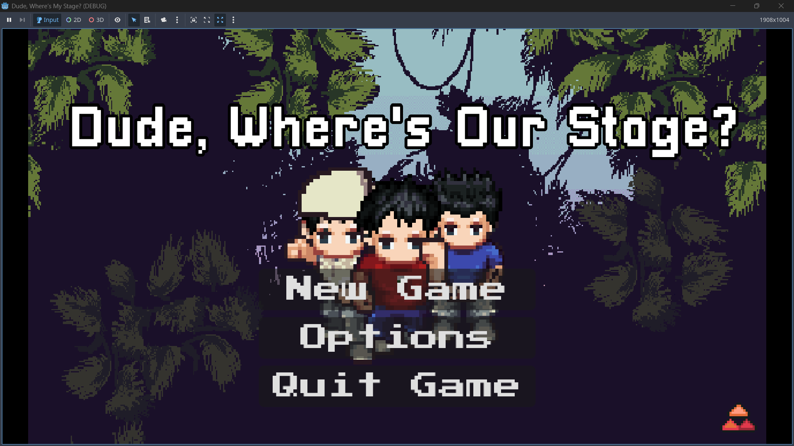
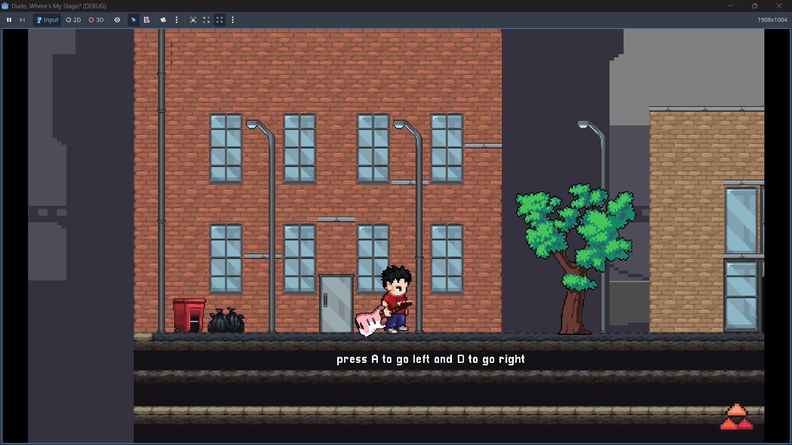
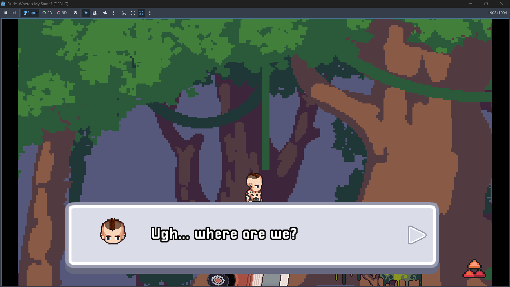
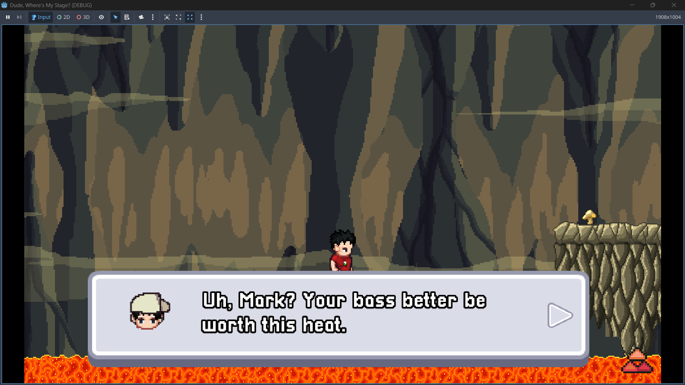
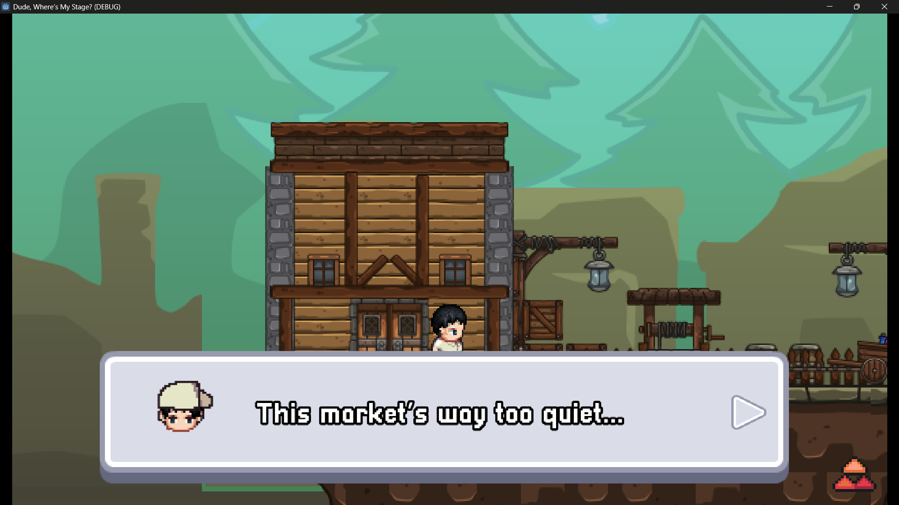

# Blink-182: Dude, Where’s Our Stage?
A retro-style platformer game inspired by classic Mario games, featuring members of Blink-182 as playable characters.

## Disclaimer

This project is a fan-made game created for educational and portfolio purposes.

Blink-182 and all related names, music, and trademarks belong to their respective owners.

No copyright infringement is intended and this project is not used for commercial purposes.

## 🎮 **Play the game here:**
https://rrovanno.itch.io/blink182-dude-wheres-our-stage

## 🎮 Game Overview
The band’s stage has mysteriously disappeared before their show.  
Help the band travel through dangerous levels to recover their stage equipment.

## 🧑‍🎤 Playable Characters
- Tom DeLonge
- Mark Hoppus
- Travis Barker

## ⚙️ Built With
- Godot Engine
- GDScript

## ✨ Features
- Retro platformer gameplay
- Enemy hazards
  
## 🚧 Status
Finished

## 📸 Screenshots

## 👨‍💻 Developer
Created by Rovanno Raaf.
